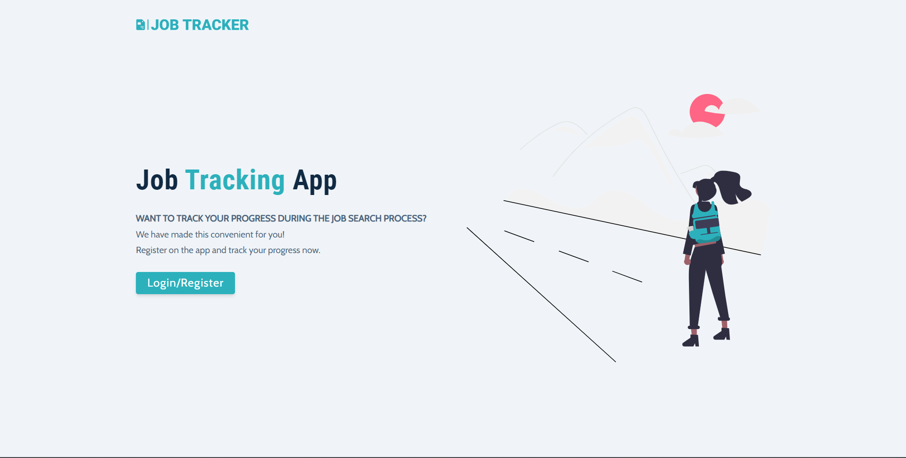
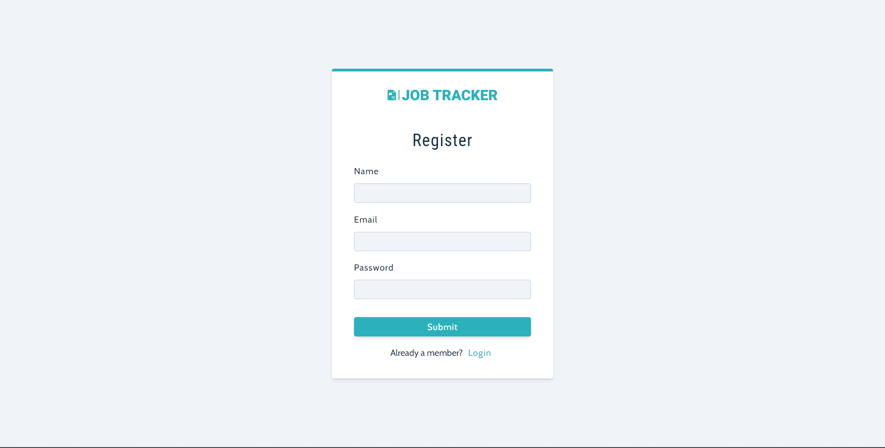
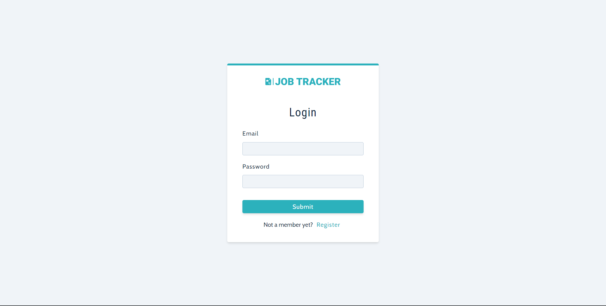
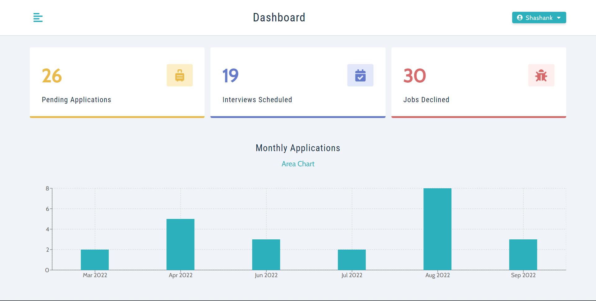
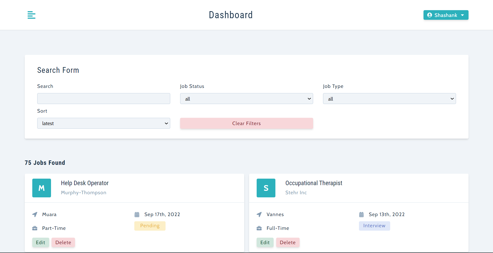
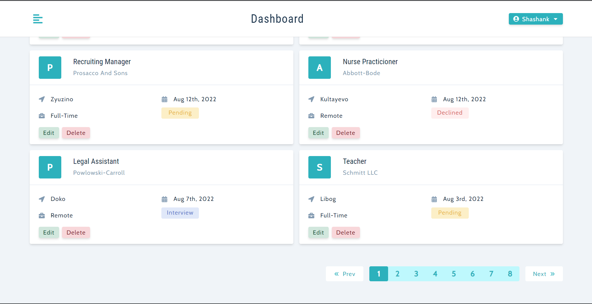
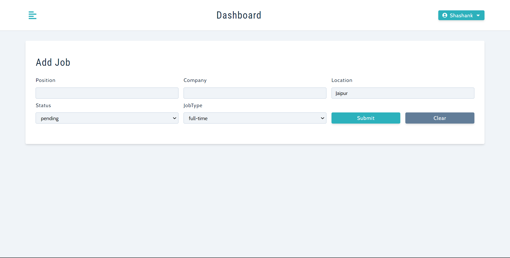
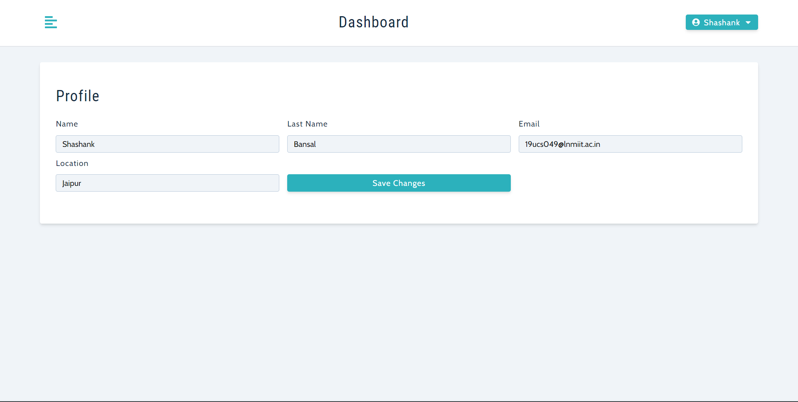

# Job Tracker

## Table of contents

-   [Introduction](#introduction)
-   [Demo](#demo)
-   [Run](#run)
-   [Technology](#technology)
-   [Features](#features)
-   [Database Models](#database)
-   [Color Palette](#colors)
-   [License](#license)

## Introduction

A website which keeps a track of your progress during the Job Search process implemented using Reactjs, Nodejs, Expressjs, and MongoDB.

NOTE: Please read the RUN section before opening an issue.

## Demo

###### Landing Page

###### Register Page

###### Login Page

###### Stats Page

###### All Jobs Page

###### Add a Job Page

###### Profile Page

The application is deployed to Heroku and can be accessed through the following link:

[Job-Tracker on Heroku](https://job-tracker-production.herokuapp.com/)

You can add the jobs you've applied for and update their status to keep a track of your progress.

## Run

To run this application, you have to set your own environmental variables. For security reasons, some variables have been hidden from view and used as environmental variables with the help of dotenv package. Below are the variables that you need to set in order to run the application:

-   MONGO_URI: this is the connection string of your MongoDB Atlas database.

-   JWT_SECRET: a secret message for the session. You can use any string here.

-   JWT_LIFETIME: the time up to which the session token will be active.

After you've set these environmental variables in the .env file at the root of the project, you can run "npm start" in the terminal and the application should work.

## Technology

The application is built with:

-   Node.js version 16.13.2
-   MongoDB version 6.0.2
-   Express version 4.18.2
-   Styled-Components version 5.3.6
-   bcryptjs: used to store the hashed password in the database
-   JSON Web Token: used for authentication
-   Express Validator: used for form validation

## Features

Users can do the following:-

-   Create an account, Login or Logout
-   Add a job with job type and status
-   Search for an applied job with various filters
-   Edit and Delete a job
-   Check the stats of all the applied jobs with a visual representation in the form of Area Chart and Bar Chart
-   View and Update their details in the profile page

## Database

All the models can be found in the models directory created using mongoose.

### User Schema:

-   name (String)
-   email (String)
-   password (String)
-   lastName (String)
-   location (String)

### Job Schema:

-   company (String)
-   position (String)
-   status (String)
-   jobType (String)
-   jobLocation (String)
-   createdBy (Mongoose.Types.ObjectId)

## Colors

Below is the color palette used in this application:

-    `#2cb1bc`
-    `#14919b`
-    `#627d98`
-    `#f0f4f8`
-    `#0f5132`
-    `#d1e7dd`
-    `#842029`
-    `#f8d7da`
-    `#e9b949`
-    `#fcefc7`
-    `#647acb`
-    `#e0e8f9`

## License

-   MIT License
-   Copyright 2022 © [Shashank Bansal](https://github.com/shashank-bansal-11)
